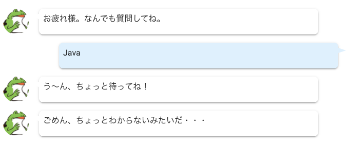

# An Interactive System for Educating Newbie Powered by AI: AI SENPAI
AI SENPAIは、AIを搭載した新人エンジニア教育用の対話システムです。


この通り、質問になんでも答えてくれます。


## 使い方
準備中

## 開発環境構築方法

1. VSCodeで開く。
1. 新しいウィンドウでRemote-Containers: Open Folder in Container...で`ui`を選択
1. 新しいウィンドウでRemote-Containers: Open Folder in Container...で`scenario-server`を選択
1. 新しいウィンドウでRemote-Containers: Open Folder in Container...で`api-server`を選択
1. `ui`コンテナと`scenario-server`コンテナそれぞれで`npm i`
1. `api-server`コンテナで`poetry install`
1. `api-server`コンテナで`pip install ginza`
1. `ui`コンテナの中で`vue ui -H 0.0.0.0`  
Vue CLI UIが`localhost:12222`で参照可能
1. UIを操作してdevサーバを起動  
    1. インポート
    1. このフォルダをインポートする
    1. タスク
    1. serve
    1. パラメータ
    1. ホストの指定→0.0.0.0
    1. 保存
    1. タスクの実行  
フロントエンドのVueのdevサーバが`localhost:13333`で参照可能
1. `scenario-server`コンテナの中でF5  
1. `api-server`コンテナの中でF5

バックエンドのExpressサーバは`localhost:14444`で参照可能。
テキスト分析のFlaskサーバは`localhost:15555`で参照可能。

## 本番ビルド方法
```
./startup.sh
```
の予定だが準備中。
